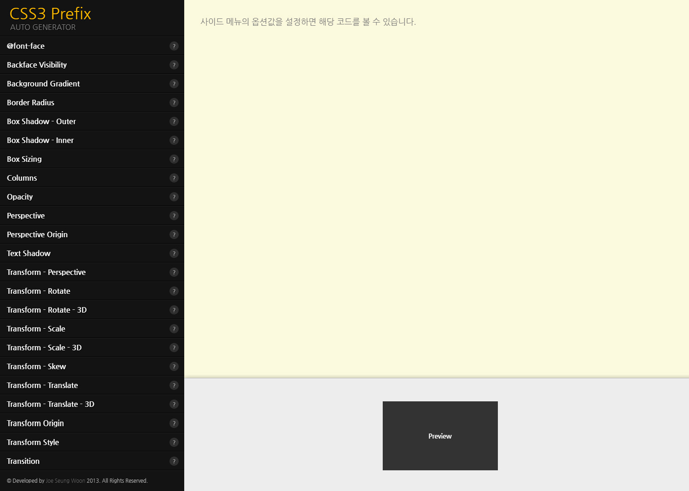

# J Generator CSS3
> CSS3 속성들을 위지윅으로 prefix 코드들을 자동생성하고 view 화면을 미리 확인 할 수 있는 유용한 웹 어플리케이션 입니다.

## preview

## Use Guide
> 좌측 패널 영역은 CSS3 속성들을 선택하여 입력할 수 있습니다. 상단 패널 영역은 코드가 출력되는 Output 화면 입니다.  하단 패널 영역은 입력된 결과가 출력되는 View 화면 입니다. 

1. 좌측 위지윅 기능 메뉴로 원하는 값을 입력 합니다.
2. 상단 패널 영역에 해당 코드의 Output 코드가 prefix 와 함께 출력 됩니다.
3. 하단 패널 영역에 Preview 화면으로 속성이 적용된 화면을 미리보기로 확인 할 수 있습니다.

## 버전
v1.0.0